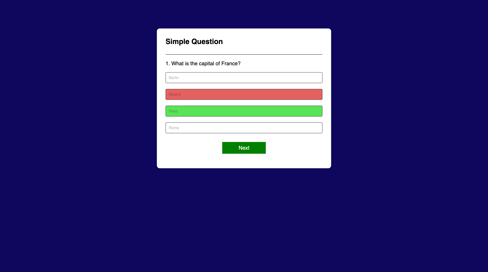
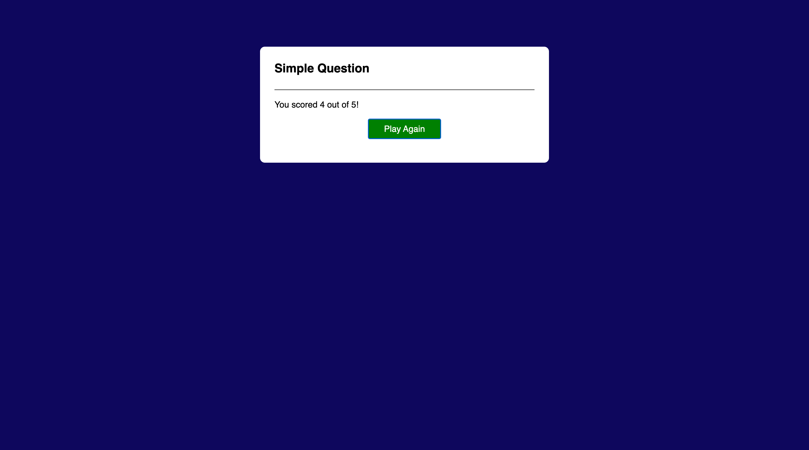

# 🧠 Simple Quiz App

An interactive and dynamic web-based quiz application built using HTML, CSS, and JavaScript. This app challenges users with multiple-choice questions and provides real-time feedback, score tracking, and the ability to replay the quiz.

---

## 📌 Table of Contents

- [Features](#-features)
- [Tech Stack](#-tech-stack)
- [How It Works](#-how-it-works)
- [Skills Demonstrated](#-skills-demonstrated)
- [Preview](#-preview)
- [Possible Enhancements](#-possible-enhancements)
- [Live Demo](#-live-demo)
- [Author](#-author)

---

## ✅ Features

- Multiple-choice questions
- Real-time answer validation
- Instant visual feedback (green for correct, red for incorrect)
- Score tracking throughout the quiz
- "Play Again" feature to reset and restart the quiz
- Responsive design for desktop and mobile screens

---

## 🛠 Tech Stack

- **HTML5** – Structure
- **CSS3** – Styling and responsiveness
- **JavaScript (ES6+)** – Logic and interactivity

---

## ⚙️ How It Works

1. Questions and answer choices are pre-defined in an array of objects.
2. When the quiz starts, the first question is dynamically displayed with choices.
3. The user selects an answer; immediate feedback is shown:
   - Correct answer: highlighted in green
   - Wrong answer: selected option turns red and correct answer turns green
4. After answering, the user can move to the next question.
5. The final score is displayed at the end with an option to replay.

---

## 🧠 Skills Demonstrated

- DOM manipulation using JavaScript
- Dynamic HTML content generation
- User interaction handling with event listeners
- Modular and clean JavaScript coding practices
- Basic responsive UI design using CSS

---

## 📸 Preview

---

## 🚀 Possible Enhancements

Here are some ideas for future improvements:

- Add a countdown timer for each question
- Randomize question and answer order
- Allow multiple quiz categories (e.g., General Knowledge, Math, Science)
- Store high scores using local storage or Firebase
- Add progress bar or quiz completion indicator
- Deploy on GitHub Pages, Netlify, or Vercel

---

## 🌐 Live Demo

👉 _Coming Soon_  
(You can deploy it on platforms like GitHub Pages, Netlify, or Vercel.)

---

## 👨‍💻 Author

**Usman Ahamed**  
🎓 Data Science Student | 💻 Aspiring Full-Stack Developer  
📫 [LinkedIn](https://www.linkedin.com/) • [GitHub](https://github.com/)

---

## 📄 License

This project is open-source and free to use under the [MIT License](LICENSE).

---
